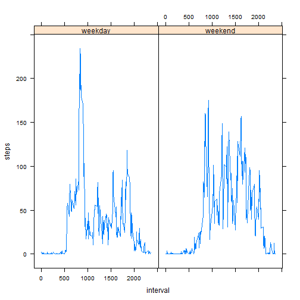

# Reproducible Research: Peer Assessment 1


## Loading and preprocessing the data
Read the comma seperated file

```r
data <- read.csv("activity.csv")
```


Convert the date column from factor to date.

```r
data <- transform(data, date = as.Date(date, format = "%Y-%m-%d"))
```


## What is mean total number of steps taken per day?
Count the steps for each day

```r
steps.per.day <- tapply(data$steps, data$date, sum, na.rm = TRUE)
barplot(steps.per.day, main = "Total Steps Per Day", ylab = "Steps", xlab = "Date")
```

 

Mean steps per day

```r
mean(steps.per.day)
```

```
## [1] 9354
```

Median steps per day

```r
median(steps.per.day)
```

```
## [1] 10395
```


## What is the average daily activity pattern?
Count the steps for each 5 minute interval 

```r
steps.per.interval <- tapply(data$steps, data$interval, mean, na.rm = TRUE)
```

Plot the average steps per interval

```r
plot(steps.per.interval, type = "l", main = "Average Steps Per Interval", xlab = "Interval", 
    ylab = "Steps")
```

 


The 5-minute interval, on average across all the days with the maximum number of steps

```r
which.max(steps.per.interval)
```

```
## 835 
## 104
```


## Imputing missing values
The total number of rows with missing values

```r
sum(!complete.cases(data))
```

```
## [1] 2304
```

Fill in the missing values with average for that invterval

```r
clean.data <- data
for (i in 1:nrow(data)) {
    if (is.na(data$steps[i])) {
        clean.data$steps[i] <- steps.per.interval[as.character(data$interval[i])]
    }
}
```


Count the steps for each day

```r
clean.steps.per.day <- tapply(clean.data$steps, clean.data$date, sum)
barplot(clean.steps.per.day, main = "Total Steps Per Day", sub = "With imputed missing values", 
    ylab = "Steps", xlab = "Date")
```

 

Mean steps per day

```r
mean(clean.steps.per.day)
```

```
## [1] 10766
```

Median steps per day

```r
median(clean.steps.per.day)
```

```
## [1] 10766
```

As you can see the mean and median were affected.  
## Are there differences in activity patterns between weekdays and weekends?
Create a new factor variable in the dataset with two levels - "weekday" and "weekend" indicating whether a given date is a weekday or weekend day.

```r
weekday <- factor(levels = c("weekday", "weekend"))
for (i in 1:nrow(data)) {
    if (weekdays(data$date[i]) %in% c("Monday", "Tuesday", "Wednesday", "Thursday", 
        "Friday")) 
        weekday[i] <- "weekday" else weekday[i] <- "weekend"
}
wk.data <- cbind(data, weekday)
```

A panel plot containing the 5-minute interval and the average number of steps taken, averaged across all weekday days or weekend days.

```r
library(lattice)
```

```
## Warning: package 'lattice' was built under R version 3.0.3
```

```r
wk.data.avg <- aggregate(steps ~ interval + weekday, data = wk.data, FUN = mean)
xyplot(steps ~ interval | weekday, data = wk.data.avg, type = "l")
```

 


